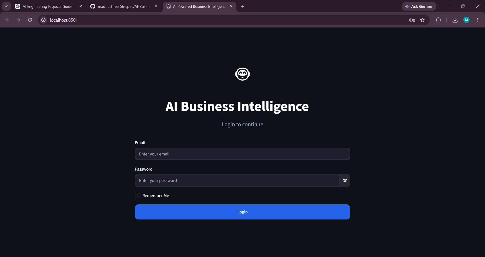
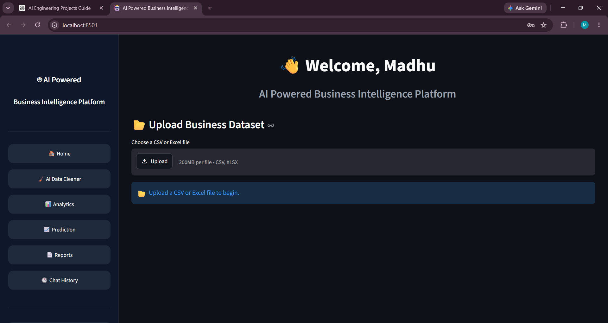
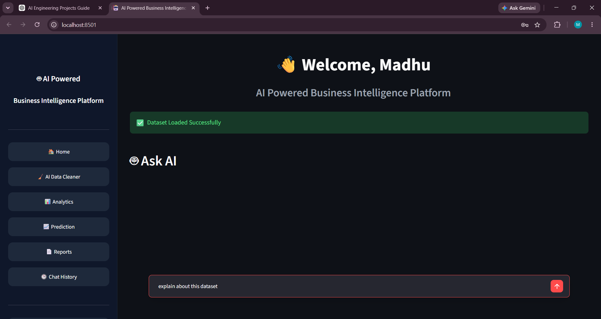
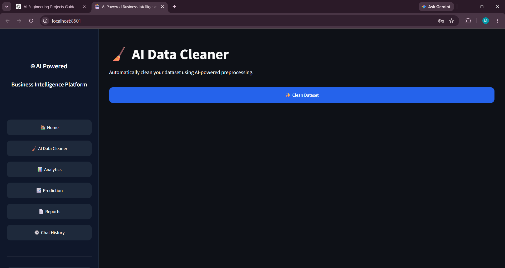
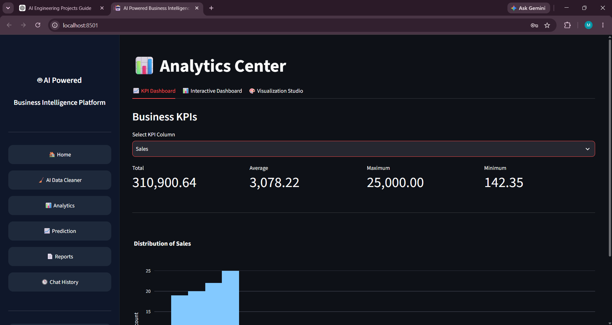
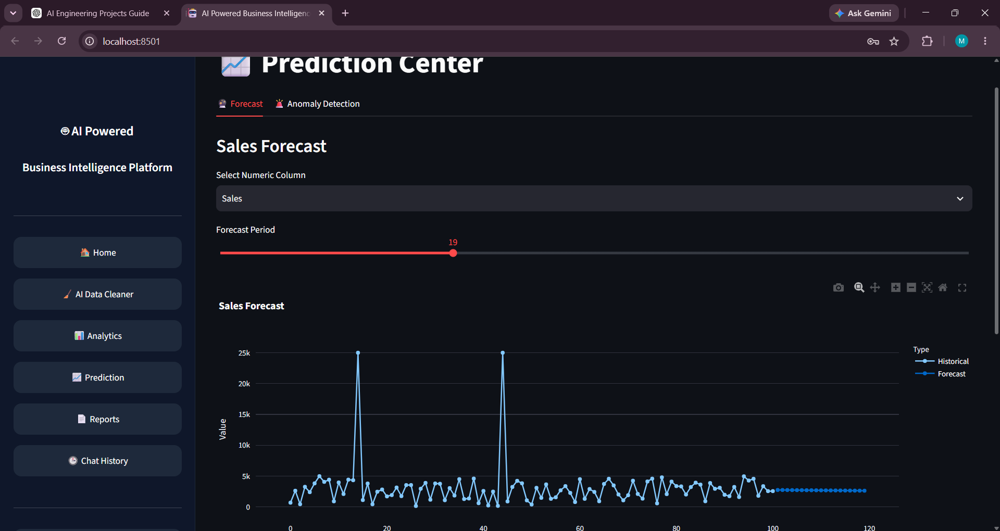
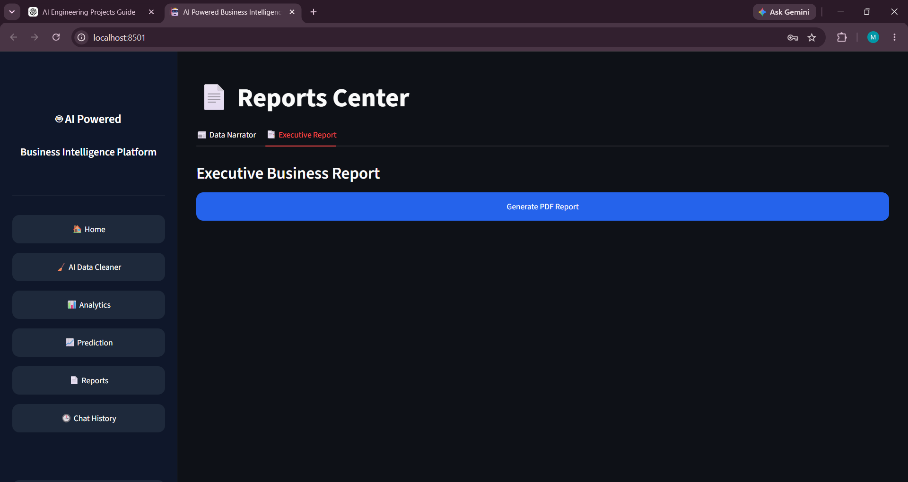

# 🤖 AI Business Intelligence Platform

An AI-powered Business Intelligence Platform that enables users to upload business datasets, generate AI-driven SQL queries, visualize insights, clean data, forecast trends, and create professional reports—all from an interactive web interface.

---

## 🚀 Features

- 📂 Upload CSV & Excel datasets
- 🤖 AI-powered SQL query generation using Gemini AI
- 📊 Interactive dashboards and visualizations
- 🧹 AI Data Cleaner
- 📈 Sales Prediction using Machine Learning
- 💡 Automated Business Insights
- 📄 PDF Report Generation
- 📤 Export Results to CSV & Excel
- 🕒 Chat History
- 🎨 Modern responsive UI with dark theme

## 🖼 Application Screenshots

### 🔐 Login Page



---

### 🏠 Home Dashboard



---

### 🤖 AI Assistant



---

### 🧹 AI Data Cleaner



---

### 📊 Analytics Dashboard



---

### 📈 Sales Prediction



---

### 📄 Reports



---

## 🛠 Tech Stack

### Frontend

- Streamlit
- HTML
- CSS

### Backend

- Python
- SQLite

### AI

- Google Gemini AI

### Machine Learning

- Scikit-learn
- Pandas
- NumPy

### Visualization

- Plotly
- Matplotlib

---

## 📂 Project Structure

```text
AI-Business-Intelligence-Platform
│
├── ai/
├── assets/
├── components/
├── data/
├── ml/
├── reports/
├── screenshots/
├── utils/
│
├── app.py
├── README.md
├── requirements.txt
└── .gitignore
```

---

## ⚙ Installation

Clone the repository

```bash
git clone https://github.com/madhushreer56-spec/AI-Business-Intelligence-Platform.git
```

Move into the project

```bash
cd AI-Business-Intelligence-Platform
```

Create a virtual environment

```bash
python -m venv venv
```

Activate the virtual environment

### Windows

```bash
venv\Scripts\activate
```

Install dependencies

```bash
pip install -r requirements.txt
```

Run the application

```bash
streamlit run app.py
```

---

## 📋 Requirements

- Python 3.11+
- Streamlit
- Gemini API Key
- SQLite

---

## 🔮 Future Enhancements

- Multi-user authentication
- Role-based dashboards
- Natural Language Report Generation
- Power BI integration
- Real-time database connectivity
- Cloud deployment
- Voice-enabled AI assistant

---

## 👩‍💻 Developed By

**Madhu Shree R**

Cyber Security Engineering Student

AI & Machine Learning Enthusiast

GitHub:
https://github.com/madhushreer56-spec

---
